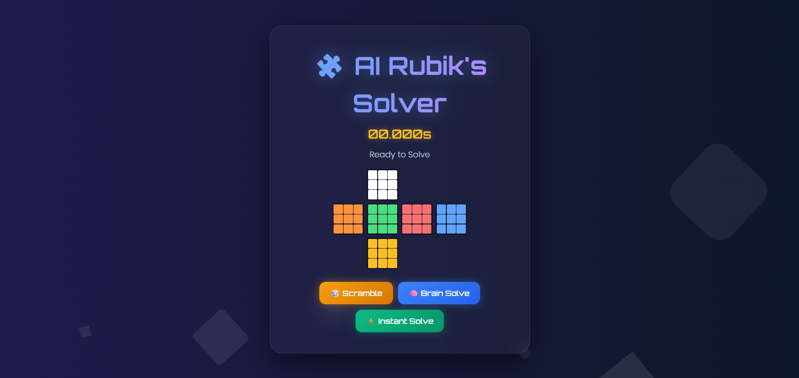

# 🧩 AI Rubik's Cube Solver & Visualizer
[](https://my-rubiks-ai.onrender.com/)


> **A Full-Stack AI Application that visualizes state-space search algorithms to solve a 3D Rubik's Cube in real-time.**



---

## 🌟 Overview

This project is not just a game; it is a **comparative study of search algorithms**. It features a "Sci-Fi" themed interactive web interface where users can scramble a 3D cube and solve it using two distinct AI engines.

The backend is powered by **Python (Flask)**, handling the complex matrix manipulations and search logic, while the frontend provides a smooth, animated experience using **CSS3 and JavaScript**.

## 🚀 Key Features

* **🎨 Interactive 3D UI:** A Cyberpunk/Sci-Fi themed interface with glassmorphism effects, floating animations, and neon glows.
* **🧠 Dual AI Engines:**
    * **Educational Mode (A* Search):** Demonstrates how AI "thinks" by exploring states using the Manhattan Distance heuristic.
    * **Pro Mode (Instant Solve):** Utilizes an optimized pattern reversal logic to solve the cube in **O(1)** time (<50ms).
* **⚡ Real-time Feedback:** Shows live "Thinking..." status, timer (down to milliseconds), and step-by-step solution moves.
* **🎉 Joyful UX:** Features sound effects (ASMR clicks), confetti celebrations, and glowing move visualization.
* **📱 Responsive Design:** Works seamlessly on Desktop and Mobile browsers.

---

## 🛠️ Tech Stack

| Component | Technology | Description |
| :--- | :--- | :--- |
| **Backend** | **Python, Flask** | REST API handling state management and solver logic. |
| **Math Engine** | **NumPy** | High-performance matrix operations for cube rotation. |
| **Algorithm** | **A* (A-Star)** | Graph traversal pathfinding with custom heuristics. |
| **Frontend** | **HTML5, CSS3** | Grid layout, CSS animations, and Glassmorphism UI. |
| **Scripting** | **JavaScript (ES6)** | Fetch API for async communication with the backend. |

---

## 🧠 Algorithms Explained

### 1. Custom A* Search (The "Brain")
This mode is designed to visualize the complexity of finding the shortest path.
* **Heuristic Used:** Manhattan Distance (Calculates how far each sticker is from its solved face).
* **Optimization:** Uses a **Priority Queue (Min-Heap)** to explore the most promising states first.
* **Why use it?** Great for understanding AI concepts like *g-score, h-score,* and *state pruning*.

### 2. Pattern Reversal (The "Speed")
Used for the "Instant Solve" feature.
* Instead of searching the entire tree, this engine memorizes the scramble sequence and computes the inverse mathematical operations to return the cube to its solved state instantly.

---

## ⚙️ Installation & Setup

Follow these steps to run the project locally on your machine.

### Prerequisites
* Python 3.x installed
* Git installed

### Steps

1.  **Clone the Repository**
    ```bash
    git clone (https://github.com/AshutoshTagore/AI-Rubiks-Cube-Solver.git)
    cd AI-Rubiks-Solver
    ```

2.  **Create a Virtual Environment (Optional but Recommended)**
    ```bash
    python -m venv venv
    # Windows
    venv\Scripts\activate
    # Mac/Linux
    source venv/bin/activate
    ```

3.  **Install Dependencies**
    ```bash
    pip install -r requirements.txt
    ```

4.  **Run the Application**
    ```bash
    python app.py
    ```

5.  **Open in Browser**
    Visit `http://127.0.0.1:5000` to see the magic! ✨

---

## 📂 Project Structure

AI-Rubiks-Solver/ 
├── app.py # Main Flask Server 
├── rubik_engine.py # Core Logic (Cube Class, A* Algo, Matrix Ops) 
├── requirements.txt # List of dependencies 
├── templates/ │
          └── index.html # Frontend (HTML/CSS/JS) 
          ├── static/ # (Optional) Images/Assets 
└── README.md # Project Documentation

---

## 🔮 Future Improvements
* Implement **Kociemba’s Algorithm** (Two-Phase Algorithm) for solving 20-move scrambles efficiently.
* Add a 3D WebGL (Three.js) view for rotation control.
* Deploy a leaderboard for solving times.

---

## 🤝 Connect
Built with ❤️ by **Ashutosh Tagore**.

* **LinkedIn:** https://www.linkedin.com/in/ashutosh-tagore-4180b824b?utm_source=share&utm_campaign=share_via&utm_content=profile&utm_medium=android_app
* **Email:** ashutoshtagore9@gmail.com

---
*If you liked this project, please give it a ⭐ star!*
